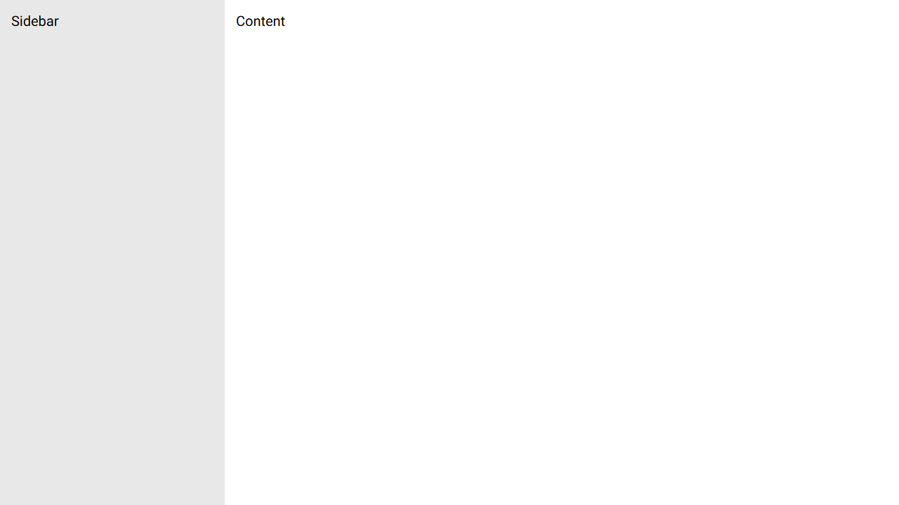
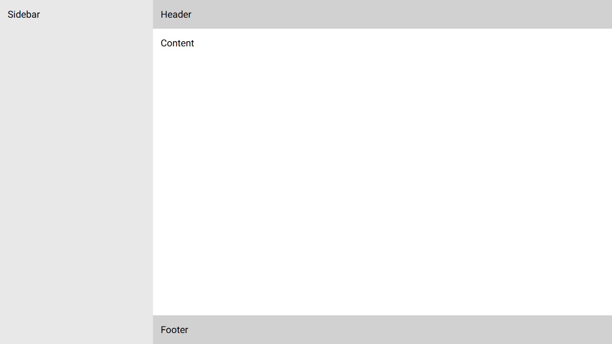
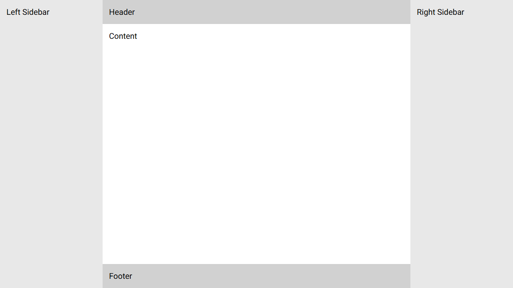
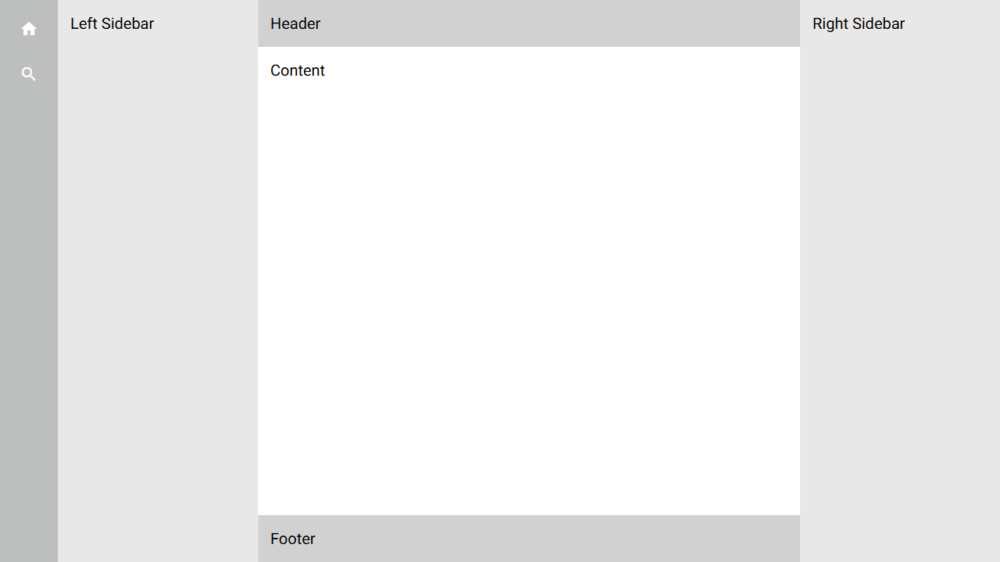

<div align="center">

# NiceGUI Tailwind Layout

A project created to provide more flexible customization by building layouts using only Tailwind in NiceGUI.

#### English | [한국어](README_KR.md)


</div>

## Common Settings

All templates share the following basic settings:

### Color Settings
```python
ui.colors(
    base_100="oklch(100% 0 0)",  # Brightest background color
    base_200="oklch(93% 0 0)",   # Sidebar background color
    base_300="oklch(86% 0 0)",   # Header/Footer background color
    base_400="oklch(80% 0 0)",   # Menubar background color (used in 4-column layout)
)
```

### Layout Style Settings
Settings for basic padding and overflow handling:
```python
ui.query(".nicegui-content").style("padding: 0; overflow: hidden;")
```

## Layout Templates

### 2 Column A ([source](templates/2_column_a.py))


```python
def app():
    with ui.element("div").classes("flex w-full h-screen"):
        # Sidebar
        with ui.element("div").classes("w-[30%] max-w-xs bg-base-200 p-4"):
            ui.label("Sidebar").classes("text-xl")
        # Main
        with ui.element("div").classes("grow bg-base-100 p-4"):
            ui.label("Content").classes("text-xl")
```

### 2 Column B ([source](templates/2_column_b.py))


```python
def app():
    with ui.element("div").classes("flex flex-col w-full h-screen"):
        # Header
        with ui.element("header").classes("min-h-[4%] bg-base-300 p-4"):
            ui.label("Header").classes("text-xl")
        # Main content with sidebar
        with ui.element("div").classes("flex grow"):
            with ui.element("div").classes("w-[30%] max-w-xs bg-base-200 p-4"):
                ui.label("Sidebar").classes("text-xl")
            with ui.element("div").classes("grow bg-base-100 p-4"):
                ui.label("Content").classes("text-xl")
        # Footer
        with ui.element("footer").classes("min-h-[4%] bg-base-300 p-4"):
            ui.label("Footer").classes("text-xl")
```

### 2 Column C ([source](templates/2_column_c.py))


```python
def app():
    with ui.element("div").classes("flex w-full h-screen"):
        # Sidebar
        with ui.element("div").classes("w-[30%] max-w-xs bg-base-200 p-4"):
            ui.label("Sidebar").classes("text-xl")

        # Main
        with ui.element("div").classes("flex flex-col grow h-full"):
            # Header
            with ui.element("header").classes("min-h-[4%] bg-base-300 p-4"):
                ui.label("Header").classes("text-xl")

            # Content
            with ui.element("div").classes("grow bg-base-100 p-4"):
                ui.label("Content").classes("text-xl")
            # Footer
            with ui.element("footer").classes("min-h-[4%] bg-base-300 p-4"):
                ui.label("Footer").classes("text-xl")
```

### 3 Column A ([source](templates/3_column_a.py))


```python
def app():
    with ui.element("div").classes("flex w-full h-screen"):
        # Left Sidebar
        with ui.element("div").classes("w-[20%] max-w-xs bg-base-200 p-4"):
            ui.label("Left Sidebar").classes("text-xl")
        # Content
        with ui.element("div").classes("grow bg-base-100 p-4"):
            ui.label("Content").classes("text-xl")
        # Right Sidebar
        with ui.element("div").classes("w-[20%] max-w-xs bg-base-200 p-4"):
            ui.label("Right Sidebar").classes("text-xl")
```

### 3 Column B ([source](templates/3_column_b.py))


```python
def app():
    with ui.element("div").classes("flex flex-col w-full h-screen"):
        # Header
        with ui.element("header").classes("bg-base-300 p-4"):
            ui.label("Header").classes("text-xl")

        # Main
        with ui.element("div").classes("flex flex-1"):
            # Left Sidebar
            with ui.element("div").classes("w-[20%] max-w-xs bg-base-200 p-4"):
                ui.label("Left Sidebar").classes("text-xl")

            # Content
            with ui.element("div").classes("grow bg-base-100 p-4"):
                ui.label("Content").classes("text-xl")

            # Right Sidebar
            with ui.element("div").classes("w-[20%] max-w-xs bg-base-200 p-4"):
                ui.label("Right Sidebar").classes("text-xl")

        # Footer
        with ui.element("footer").classes("bg-base-300 p-4"):
            ui.label("Footer").classes("text-xl")
```

### 3 Column C ([source](templates/3_column_c.py))


```python
def app():
    with ui.element("div").classes("flex w-full h-screen"):
        # Left Sidebar
        with ui.element("div").classes("w-[20%] max-w-xs bg-base-200 p-4"):
            ui.label("Left Sidebar").classes("text-xl")

        # Main
        with ui.element("div").classes("flex flex-col grow h-full"):
            # Header
            with ui.element("header").classes("min-h-[4%] bg-base-300 p-4"):
                ui.label("Header").classes("text-xl")

            # Content
            with ui.element("div").classes("grow bg-base-100 p-4"):
                ui.label("Content").classes("text-xl")

            # Footer
            with ui.element("footer").classes("min-h-[4%] bg-base-300 p-4"):
                ui.label("Footer").classes("text-xl")

        # Right Sidebar
        with ui.element("div").classes("w-[20%] max-w-xs bg-base-200 p-4"):
            ui.label("Right Sidebar").classes("text-xl")
```

### 4 Column A ([source](templates/4_column_a.py))


```python
def app():
    with ui.element("div").classes("flex w-full h-screen"):
        # MenuBar
        with ui.element("div").classes(
            "flex flex-col w-xs bg-base-400 p-4 items-center justify-start gap-4"
        ):
            ui.button(icon="home", color="base-100").props("flat round")
            ui.button(icon="search", color="base-100").props("flat round")
        # Left Sidebar
        with ui.element("div").classes("w-[20%] max-w-xs bg-base-200 p-4"):
            ui.label("Left Sidebar").classes("text-xl")
        # Content
        with ui.element("div").classes("grow bg-base-100 p-4"):
            ui.label("Content").classes("text-xl")
        # Right Sidebar
        with ui.element("div").classes("w-[20%] max-w-xs bg-base-200 p-4"):
            ui.label("Right Sidebar").classes("text-xl")
```

### 4 Column B ([source](templates/4_column_b.py))


```python
def app():
    with ui.element("div").classes("flex flex-col w-full h-screen"):
        # Header
        with ui.element("header").classes("bg-base-300 p-4"):
            ui.label("Header").classes("text-xl")

        # Main
        with ui.element("div").classes("flex flex-1"):
            # MenuBar
            with ui.element("div").classes(
                "flex flex-col w-xs bg-base-400 p-4 items-center justify-start gap-4"
            ):
                ui.button(icon="home", color="base-100").props("flat round")
                ui.button(icon="search", color="base-100").props("flat round")

            # Left Sidebar
            with ui.element("div").classes("w-[20%] max-w-xs bg-base-200 p-4"):
                ui.label("Left Sidebar").classes("text-xl")

            # Content
            with ui.element("div").classes("grow bg-base-100 p-4"):
                ui.label("Content").classes("text-xl")

            # Right Sidebar
            with ui.element("div").classes("w-[20%] max-w-xs bg-base-200 p-4"):
                ui.label("Right Sidebar").classes("text-xl")

        # Footer
        with ui.element("footer").classes("bg-base-300 p-4"):
            ui.label("Footer").classes("text-xl")
```

### 4 Column C ([source](templates/4_column_c.py))


```python
def app():
    with ui.element("div").classes("flex w-full h-screen"):
        # MenuBar
        with ui.element("div").classes(
            "flex flex-col w-xs bg-base-400 p-4 items-center justify-start gap-4"
        ):
            ui.button(icon="home", color="base-100").props("flat round")
            ui.button(icon="search", color="base-100").props("flat round")

        # Left Sidebar
        with ui.element("div").classes("w-[20%] max-w-xs bg-base-200 p-4"):
            ui.label("Left Sidebar").classes("text-xl")

        # Main
        with ui.element("div").classes("flex flex-col grow h-full"):
            # Header
            with ui.element("header").classes("min-h-[4%] bg-base-300 p-4"):
                ui.label("Header").classes("text-xl")

            # Content
            with ui.element("div").classes("grow bg-base-100 p-4"):
                ui.label("Content").classes("text-xl")

            # Footer
            with ui.element("footer").classes("min-h-[4%] bg-base-300 p-4"):
                ui.label("Footer").classes("text-xl")

        # Right Sidebar
        with ui.element("div").classes("w-[20%] max-w-xs bg-base-200 p-4"):
            ui.label("Right Sidebar").classes("text-xl")
```

## Tech Stack

- Python 3.12
- NiceGUI
- Tailwind CSS
- UV (Package Manager)

## How to Run

### 1. Install Dependencies:
```bash
git clone https://github.com/easydevv/nicegui-tailwind-layout.git
cd nicegui-tailwind-layout
```

```bash
uv venv
uv sync
```

### 2. Run the Application:
```bash
python main.py
```

## Template List

You can see the list of templates when you run the application.

